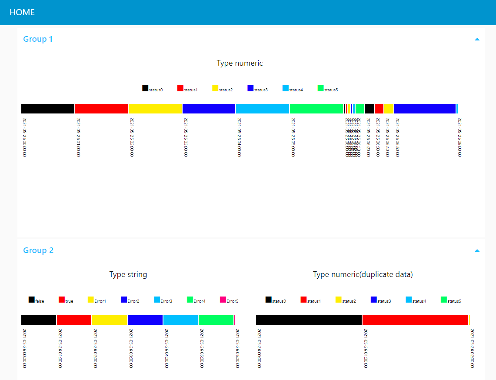

# node-red-contrib-ui_status_chart

A Node-RED widget node for showing the chart of status.

 "example")

## Pre-requisites

The node-red-contrib-ui_status_chart requires `Node-RED Dashboard 2.10` to be installed.

## Install

```cmd
npm install node-red-contrib-ui_status_chart
```

**Note**: This node uses APIs that require at least Node-RED 0.19 and Node-RED Dashboard 2.10.

## Usage

ui_status_chart node is a UI widget that can be used to display the chart of status in the Node-RED dashboard.

- Widget properties

  - group

      Set the group to be displayed on the dashboard

  - size

      Set the size on the dashboard

  - label

      Set the name to be displayed on the dashboard

  - Graph display settings

      Set the `display color`,`state name`, and `specified value` to be displayed on the chart.

  - name

      Set the node name to be displayed in flow

- Input items

    An array of Items is passed in by msg.payload. It consists of objects containing the following properties.

    ```typescript
    type graphDataObject = {
        "datetime": Date;
        "value": number | string;
    }
    ```

    ```json
    [
        {"datetime":"2021-05-26T00:00:00+09:00", "value":0},
        {"datetime":"2021-05-26T01:00:00+09:00", "value":1},
        {"datetime":"2021-05-26T02:00:00+09:00", "value":2},
        {"datetime":"2021-05-26T03:00:00+09:00", "value":3},
        {"datetime":"2021-05-26T04:00:00+09:00", "value":4},
        {"datetime":"2021-05-26T05:00:00+09:00", "value":5},
        {"datetime":"2021-05-26T06:00:00+09:00", "value":0},
        {"datetime":"2021-05-26T06:02:00+09:00", "value":true},
        {"datetime":"2021-05-26T06:04:00+09:00", "value":false},
        {"datetime":"2021-05-26T06:06:00+09:00", "value":3},
        {"datetime":"2021-05-26T06:08:00+09:00", "value":4},
        {"datetime":"2021-05-26T06:10:00+09:00", "value":5},
        {"datetime":"2021-05-26T06:20:00+09:00", "value":0},
        {"datetime":"2021-05-26T06:30:00+09:00", "value":1},
        {"datetime":"2021-05-26T06:40:00+09:00", "value":"Error:1"},
        {"datetime":"2021-05-26T06:50:00+09:00", "value":3},
        {"datetime":"2021-05-26T08:00:00+09:00", "value":"Error:2"}
    ]
    ```

- example

    ```json
    [
        {
            "id": "5a325280.b684bc",
            "type": "tab",
            "label": "fllow 1",
            "disabled": false,
            "info": ""
        },
        {
            "id": "5aaa0c08.5ad7b4",
            "type": "inject",
            "z": "5a325280.b684bc",
            "name": "",
            "props": [
                {
                    "p": "payload"
                },
                {
                    "p": "topic",
                    "vt": "str"
                }
            ],
            "repeat": "",
            "crontab": "",
            "once": true,
            "onceDelay": 0.1,
            "topic": "",
            "payload": "",
            "payloadType": "date",
            "x": 120,
            "y": 60,
            "wires": [
                [
                    "bd18337b.43c31"
                ]
            ]
        },
        {
            "id": "bd18337b.43c31",
            "type": "template",
            "z": "5a325280.b684bc",
            "name": "Type numeric",
            "field": "payload",
            "fieldType": "msg",
            "format": "json",
            "syntax": "mustache",
            "template": "[\n    {\"datetime\":\"2021-05-26T00:00:00+09:00\", \"value\":0},\n    {\"datetime\":\"2021-05-26T01:00:00+09:00\", \"value\":1},\n    {\"datetime\":\"2021-05-26T02:00:00+09:00\", \"value\":2},\n    {\"datetime\":\"2021-05-26T03:00:00+09:00\", \"value\":3},\n    {\"datetime\":\"2021-05-26T04:00:00+09:00\", \"value\":4},\n    {\"datetime\":\"2021-05-26T05:00:00+09:00\", \"value\":5},\n    {\"datetime\":\"2021-05-26T06:00:00+09:00\", \"value\":0},\n    {\"datetime\":\"2021-05-26T06:02:00+09:00\", \"value\":1},\n    {\"datetime\":\"2021-05-26T06:04:00+09:00\", \"value\":2},\n    {\"datetime\":\"2021-05-26T06:06:00+09:00\", \"value\":3},\n    {\"datetime\":\"2021-05-26T06:08:00+09:00\", \"value\":4},\n    {\"datetime\":\"2021-05-26T06:10:00+09:00\", \"value\":5},\n    {\"datetime\":\"2021-05-26T06:20:00+09:00\", \"value\":0},\n    {\"datetime\":\"2021-05-26T06:30:00+09:00\", \"value\":1},\n    {\"datetime\":\"2021-05-26T06:40:00+09:00\", \"value\":2},\n    {\"datetime\":\"2021-05-26T06:50:00+09:00\", \"value\":3},\n    {\"datetime\":\"2021-05-26T08:00:00+09:00\", \"value\":4}\n]",
            "output": "json",
            "x": 340,
            "y": 60,
            "wires": [
                [
                    "6e240513.be6f2c"
                ]
            ]
        },
        {
            "id": "6e240513.be6f2c",
            "type": "ui_status_chart",
            "z": "5a325280.b684bc",
            "group": "ead3fc9.832a3",
            "name": "Type numeric",
            "order": 0,
            "label": "Type numeric",
            "width": 0,
            "height": 0,
            "storeOutMessages": true,
            "fwdInMessages": true,
            "params": [
                {
                    "statusColor": "#000000",
                    "statusValue": "0",
                    "statusLabel": "status0"
                },
                {
                    "statusColor": "#ff0000",
                    "statusValue": "1",
                    "statusLabel": "status1"
                },
                {
                    "statusColor": "#ffee00",
                    "statusValue": "2",
                    "statusLabel": "status2"
                },
                {
                    "statusColor": "#1100ff",
                    "statusValue": "3",
                    "statusLabel": "status3"
                },
                {
                    "statusColor": "#00bfff",
                    "statusValue": "4",
                    "statusLabel": "status4"
                },
                {
                    "statusColor": "#00ff62",
                    "statusValue": "5",
                    "statusLabel": "status5"
                }
            ],
            "x": 620,
            "y": 60,
            "wires": [
                [
                    "da70c012.becf3"
                ]
            ]
        },
        {
            "id": "da70c012.becf3",
            "type": "debug",
            "z": "5a325280.b684bc",
            "name": "",
            "active": true,
            "tosidebar": true,
            "console": false,
            "tostatus": false,
            "complete": "false",
            "statusVal": "",
            "statusType": "auto",
            "x": 910,
            "y": 60,
            "wires": []
        },
        {
            "id": "a4795620.b71918",
            "type": "inject",
            "z": "5a325280.b684bc",
            "name": "",
            "props": [
                {
                    "p": "payload"
                },
                {
                    "p": "topic",
                    "vt": "str"
                }
            ],
            "repeat": "",
            "crontab": "",
            "once": true,
            "onceDelay": 0.1,
            "topic": "",
            "payload": "",
            "payloadType": "date",
            "x": 120,
            "y": 140,
            "wires": [
                [
                    "1391d2dc.1d65ad"
                ]
            ]
        },
        {
            "id": "1391d2dc.1d65ad",
            "type": "template",
            "z": "5a325280.b684bc",
            "name": "Type string",
            "field": "payload",
            "fieldType": "msg",
            "format": "json",
            "syntax": "mustache",
            "template": "[\n    {\"datetime\":\"2021-05-26T00:00:00+09:00\", \"value\":false},\n    {\"datetime\":\"2021-05-26T01:00:00+09:00\", \"value\":true},\n    {\"datetime\":\"2021-05-26T02:00:00+09:00\", \"value\":\"ERROR1\"},\n    {\"datetime\":\"2021-05-26T03:00:00+09:00\", \"value\":\"ERROR2\"},\n    {\"datetime\":\"2021-05-26T04:00:00+09:00\", \"value\":\"ERROR3\"},\n    {\"datetime\":\"2021-05-26T05:00:00+09:00\", \"value\":\"ERROR4\"},\n    {\"datetime\":\"2021-05-26T06:00:00+09:00\", \"value\":\"ERROR5\"}\n]",
            "output": "json",
            "x": 330,
            "y": 140,
            "wires": [
                [
                    "50471f6e.364a1"
                ]
            ]
        },
        {
            "id": "50471f6e.364a1",
            "type": "ui_status_chart",
            "z": "5a325280.b684bc",
            "group": "b34577b7.7dc8e8",
            "name": "Type string",
            "order": 0,
            "label": "Type string",
            "width": "10",
            "height": "8",
            "storeOutMessages": true,
            "fwdInMessages": true,
            "params": [
                {
                    "statusColor": "#000000",
                    "statusValue": "false",
                    "statusLabel": "false"
                },
                {
                    "statusColor": "#ff0000",
                    "statusValue": "true",
                    "statusLabel": "true"
                },
                {
                    "statusColor": "#ffee00",
                    "statusValue": "ERROR1",
                    "statusLabel": "Error1"
                },
                {
                    "statusColor": "#1100ff",
                    "statusValue": "ERROR2",
                    "statusLabel": "Error2"
                },
                {
                    "statusColor": "#00bfff",
                    "statusValue": "ERROR3",
                    "statusLabel": "Error3"
                },
                {
                    "statusColor": "#00ff62",
                    "statusValue": "ERROR4",
                    "statusLabel": "Error4"
                },
                {
                    "statusColor": "#ff0080",
                    "statusValue": "ERROR5",
                    "statusLabel": "Error5"
                }
            ],
            "x": 610,
            "y": 140,
            "wires": [
                [
                    "6e44d076.9fa89"
                ]
            ]
        },
        {
            "id": "6e44d076.9fa89",
            "type": "debug",
            "z": "5a325280.b684bc",
            "name": "",
            "active": true,
            "tosidebar": true,
            "console": false,
            "tostatus": false,
            "complete": "false",
            "statusVal": "",
            "statusType": "auto",
            "x": 910,
            "y": 140,
            "wires": []
        },
        {
            "id": "12f2345a.d0d67c",
            "type": "inject",
            "z": "5a325280.b684bc",
            "name": "",
            "props": [
                {
                    "p": "payload"
                },
                {
                    "p": "topic",
                    "vt": "str"
                }
            ],
            "repeat": "",
            "crontab": "",
            "once": true,
            "onceDelay": 0.1,
            "topic": "",
            "payload": "",
            "payloadType": "date",
            "x": 120,
            "y": 220,
            "wires": [
                [
                    "f3206b23.22d7e8"
                ]
            ]
        },
        {
            "id": "7058921a.6c383c",
            "type": "debug",
            "z": "5a325280.b684bc",
            "name": "",
            "active": true,
            "tosidebar": true,
            "console": false,
            "tostatus": false,
            "complete": "false",
            "statusVal": "",
            "statusType": "auto",
            "x": 910,
            "y": 220,
            "wires": []
        },
        {
            "id": "f3206b23.22d7e8",
            "type": "template",
            "z": "5a325280.b684bc",
            "name": "type numeric(duplicate data)",
            "field": "payload",
            "fieldType": "msg",
            "format": "json",
            "syntax": "mustache",
            "template": "[\n    {\"datetime\":\"2021-05-26T00:00:00+09:00\", \"value\":0},\n    {\"datetime\":\"2021-05-26T00:00:00+09:00\", \"value\":1},\n    {\"datetime\":\"2021-05-26T00:00:00+09:00\", \"value\":2},\n    {\"datetime\":\"2021-05-26T00:00:00+09:00\", \"value\":3},\n    {\"datetime\":\"2021-05-26T00:00:00+09:00\", \"value\":4},\n    {\"datetime\":\"2021-05-26T00:00:00+09:00\", \"value\":5},\n    {\"datetime\":\"2021-05-26T01:00:00+09:00\", \"value\":1},\n    {\"datetime\":\"2021-05-26T01:00:00+09:00\", \"value\":2},\n    {\"datetime\":\"2021-05-26T01:00:00+09:00\", \"value\":3},\n    {\"datetime\":\"2021-05-26T01:00:00+09:00\", \"value\":4},\n    {\"datetime\":\"2021-05-26T01:00:00+09:00\", \"value\":5},\n    {\"datetime\":\"2021-05-26T02:00:00+09:00\", \"value\":2}\n]",
            "output": "json",
            "x": 380,
            "y": 220,
            "wires": [
                [
                    "608af0b.da26b1"
                ]
            ]
        },
        {
            "id": "608af0b.da26b1",
            "type": "ui_status_chart",
            "z": "5a325280.b684bc",
            "group": "b34577b7.7dc8e8",
            "name": "Type numeric(duplicate data)",
            "order": 0,
            "label": "Type numeric(duplicate data)",
            "width": "10",
            "height": "8",
            "storeOutMessages": true,
            "fwdInMessages": true,
            "params": [
                {
                    "statusColor": "#000000",
                    "statusValue": "0",
                    "statusLabel": "status0"
                },
                {
                    "statusColor": "#ff0000",
                    "statusValue": "1",
                    "statusLabel": "status1"
                },
                {
                    "statusColor": "#ffee00",
                    "statusValue": "2",
                    "statusLabel": "status2"
                },
                {
                    "statusColor": "#1100ff",
                    "statusValue": "3",
                    "statusLabel": "status3"
                },
                {
                    "statusColor": "#00bfff",
                    "statusValue": "4",
                    "statusLabel": "status4"
                },
                {
                    "statusColor": "#00ff62",
                    "statusValue": "5",
                    "statusLabel": "status5"
                }
            ],
            "x": 660,
            "y": 220,
            "wires": [
                [
                    "7058921a.6c383c"
                ]
            ]
        },
        {
            "id": "ead3fc9.832a3",
            "type": "ui_group",
            "name": "Group 1",
            "tab": "35250d78.e38892",
            "order": 1,
            "disp": true,
            "width": "20",
            "collapse": true
        },
        {
            "id": "b34577b7.7dc8e8",
            "type": "ui_group",
            "name": "Group 2",
            "tab": "35250d78.e38892",
            "order": 2,
            "disp": true,
            "width": "20",
            "collapse": true
        },
        {
            "id": "35250d78.e38892",
            "type": "ui_tab",
            "name": "HOME",
            "icon": "dashboard",
            "disabled": false,
            "hidden": false
        }
    ]
    ```
